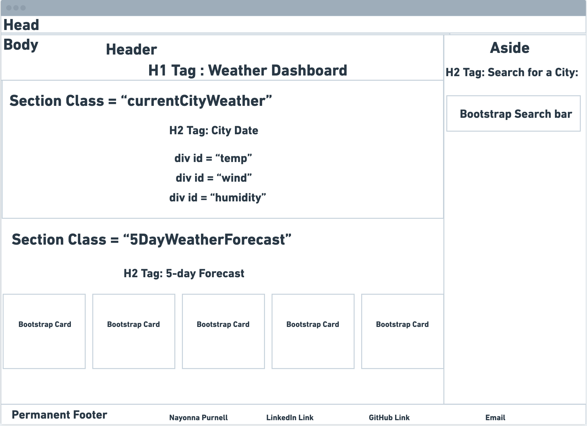

# Weather-Dash-Server-Side-API

The Horiseon Company has shared that they want to provide weather updates and information to their traveling consulting team.  They have hired me to create a Weather Dashboard for it's consultants to search, view, and save the weather information for the cities that they travel to for project work.

## Project Summary

The following tasks were completed based upon the User Story's acceptance criteria found below:

### User Story

```
AS A traveler
I WANT to see the weather outlook for multiple cities
SO THAT I can plan a trip accordingly
```

### Acceptance Criteria

```
GIVEN a weather dashboard with form inputs
* WHEN I search for a city
* THEN I am presented with current and future conditions for that city and that city is added to the search     history
* WHEN I view current weather conditions for that city
* THEN I am presented with the city name, the date, an icon representation of weather conditions, the temperature, the humidity, and the wind speed
* WHEN I view future weather conditions for that city
* THEN I am presented with a 5-day forecast that displays the date, an icon representation of weather conditions, the temperature, the wind speed, and the humidity
* WHEN I click on a city in the search history
* THEN I am again presented with current and future conditions for that city
```

## Project Link
Here you can find the link to the deployed application:
https://nayonnapurnell.github.io/Weather-Dash-Server-Side-API/


## Wireframe

The following image demonstrates the web application's Wireframe:



## Mock-Up
The following image demonstrates the web application's appearance and functionality:


## Authors

* **Nayonna Purnell** - *Edited the README Template for the project*

## License

This project is licensed under the [](https://opensource.org/licenses/MIT)


